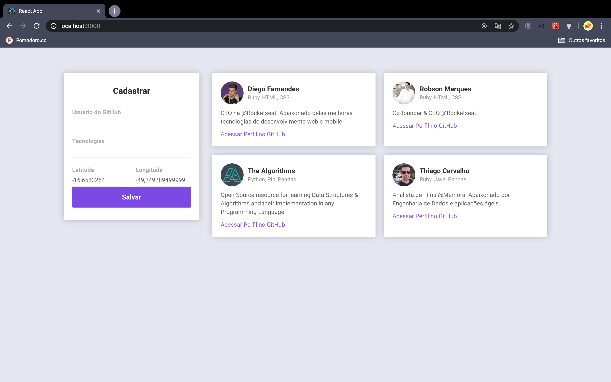
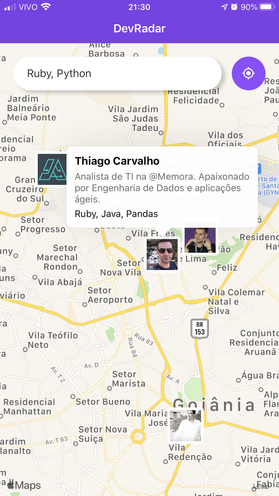

# Dev Radar
> This project was developed during the Omnistack 10 Week, which was conceived by [Rocketseat](https://rocketseat.com.br) and taught by [Diego Fernandes](https://www.linkedin.com/in/diego-schell-fernandes/).

It consists of developing an application for registration and search for developers using geolocation and specific knowledge. The project contains Backend, Web Frontend and Mobile Frontend using JavaScript-based keyboarding.

### Images

> Web viewing with React

> Mobile viewing with React Native

## Meta

> Thiago Carvalho | [Twitter](https://twitter.com/Carvalho_gyn) | [Linkedin](https://www.linkedin.com/in/thiago-ribeiro-carvalho/) | [GitHub](https://github.com/CarvalhoGyn)