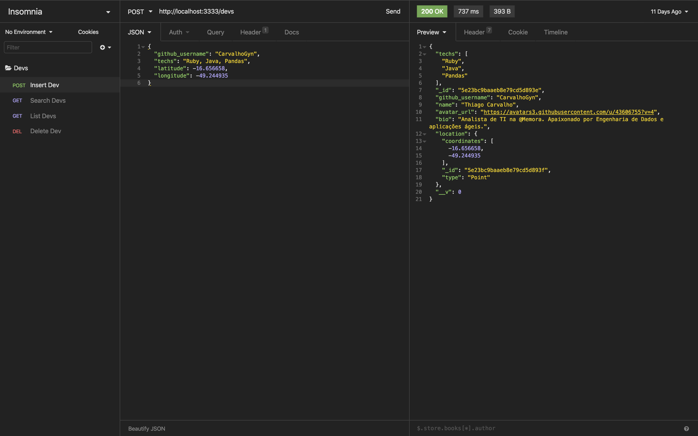

# Dev Radar Backend

> The present repository contains the entire project backend. It was developed using Node, in order to provide Rest Full services for Web and Mobile applications.

The application was developed using Node, provides Restful services for Web and Mobile applications. Uses MongoDb database to store developer information.

> Insominia exemple


## To use

```sh
yarn install
```

you will need an active MongoDb, change the connection in [index.js](src/index.js) to yours.

```js
mongoose.connect('<yourConnection>', {
    useNewUrlParser: true,
    useUnifiedTopology: true
})
```

```sh
yarn dev
```

## Meta

> Thiago Carvalho | [Twitter](https://twitter.com/Carvalho_gyn) | [Linkedin](https://www.linkedin.com/in/thiago-ribeiro-carvalho/) | [GitHub](https://github.com/CarvalhoGyn)