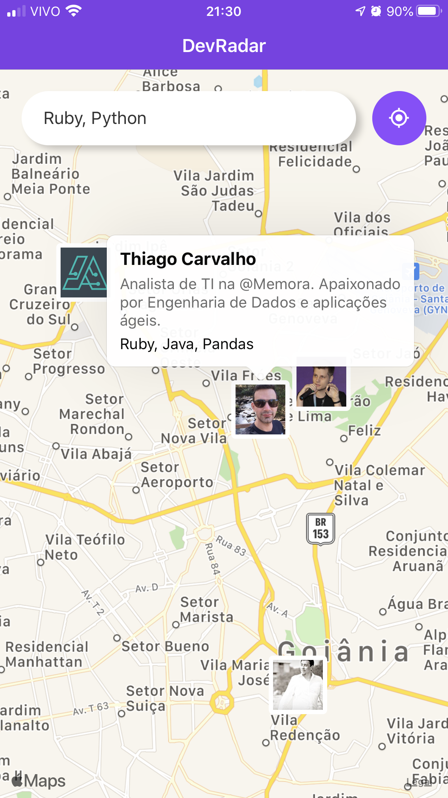
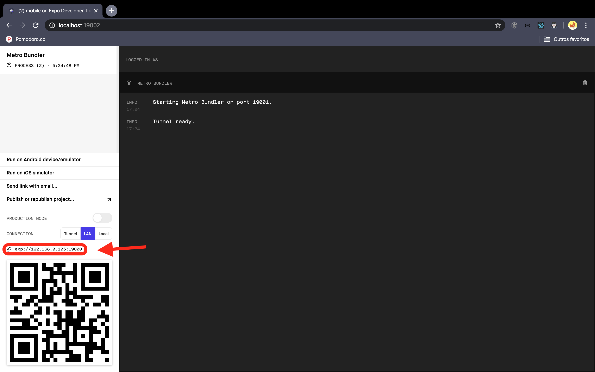

# Dev Radar Mobile

> APP to search for developers in an area.

This App is responsible for locating developers with specific knowledge within a 10km radius. After performing the search, if a new developer registers within the search radius, it will appear automatically.



## Installation

```sh
yarn install
```

```sh
yarn start
```

Change the IP in the [socket.js](src/services/socket.js) and [Api.js](src/services/Api.js) files according to what is shown on the Expo web interface.

> Expo web interface


```js
const socket = socketio('http://<expoIp>:3333', {
    autoConnect: false
})
```

```js
const api = Axios.create({
    baseURL: 'http://<expoIp>:3333'
})
```

Scan the QR with your smartphone

## Meta

> Thiago Carvalho | [Twitter](https://twitter.com/Carvalho_gyn) | [Linkedin](https://www.linkedin.com/in/thiago-ribeiro-carvalho/) | [GitHub](https://github.com/CarvalhoGyn)