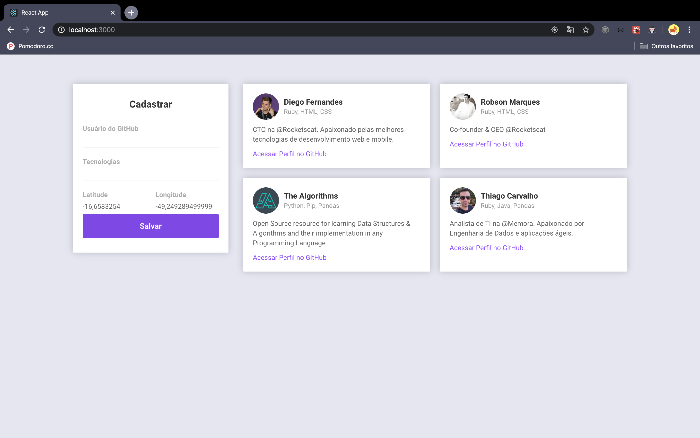

# Dev Radar Web

> This project is responsible for the Dev Radar web interface, where it is possible to create and list the developers.

When registering a new developer, the application uses geolocation to identify the location where the developer is. Several areas of knowledge can be registered and when entering the Github username, the application automatically searches for the name and bio of the developer.

> Web View


## To use

```sh
yarn install
```

```sh
yarn start
```

## Meta

> Thiago Carvalho | [Twitter](https://twitter.com/Carvalho_gyn) | [Linkedin](https://www.linkedin.com/in/thiago-ribeiro-carvalho/) | [GitHub](https://github.com/CarvalhoGyn)